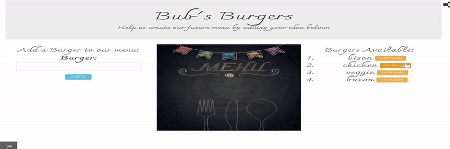

# Burger App
1. [Introduction](#introduction): 
    "Burger App" is a full-stack application following the MVC design. Node and MySQL are used to query and route data in the app. Handlebars generates the HTML. Users can input burgers of their choice to the menu list. Burgers can be removed from the list by clicking the "devoured" button. Every burger is stored in the database, to help create new daily menus for restaurants based on real diners' input. 

2. [Technologies used:](#tech)
    * MVC Model
    * Node.js
    * Handlebars
    * Heroku
    * MySQL
    * JawsDB
    * ORM (homemade)
    * Express
    * CSS
    * JS
    * JQuery
    * AJAX
  
3. Demo

